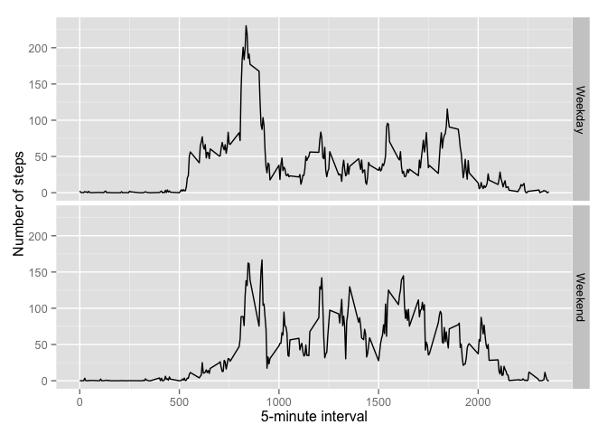

# Reproducible Research: Peer Assessment 1

First of all, it is required to set the dates to english as my system is not in that language. Moreover, I will use also the package ggplot2, then it needs to be loaded.

```r
Sys.setlocale("LC_TIME", "en_US")
```

```
## [1] "en_US"
```

```r
require(ggplot2)
```

```
## Loading required package: ggplot2
```

## Loading and preprocessing the data

I unzip the file and read the csv, specifing the type I would like to have for each column.

```r
unzip("activity.zip", exdir = "/Users/dfernandezcanon/Documents/Development/R/Project/ReproducibleResearch/Project1")

data <- read.csv("activity.csv", header=TRUE, sep=",", colClasses = c("numeric","character","numeric"))

data$date <- as.Date(data$date, "%Y-%m-%d")
```


## What is mean total number of steps taken per day?

I make a histogram of the total number of steps taken each day:

```r
stepsPerDay <- aggregate(data$steps, by=list(data$date),FUN = sum, na.rm=TRUE)
colnames(stepsPerDay) <- c("date","steps")
hist(stepsPerDay$steps, breaks = 50, xlab="Total steps taken each day")
```

 

And I calculate the mean and median total number of steps taken per day:

```r
mean(stepsPerDay$steps, na.rm=TRUE)
```

```
## [1] 9354
```

```r
median(stepsPerDay$steps, na.rm=TRUE)
```

```
## [1] 10395
```


## What is the average daily activity pattern?

I calculate the average number of steps taken doing an aggregation of the steps by 5 minutes interval. Afterwards, I display the result using a time series plot:

```r
dailyAverage <- aggregate(data$steps, by=list(data$interval), FUN = mean, na.rm=TRUE)
colnames(dailyAverage) <- c("interval","steps")
plot(dailyAverage$interval, dailyAverage$steps, type = "l", xlab = "5-minutes interval", ylab ="average number of steps taken")
```

 

I get the 5-minute interval that contains the maximum number of steps on average across all the days in the dataset:

```r
dailyAverage[which.max(dailyAverage$steps),]
```

```
##     interval steps
## 104      835 206.2
```


## Imputing missing values

I get the number of missing values:

```r
index <- which(is.na(data$steps))
length(index)
```

```
## [1] 2304
```

And I decide to use the mean for 5-minutes interval to create a dataset with the missing values filled in

```r
#new dataset using the mean for that 5-minute interval
dataNoNA <- data
dataNoNA[index,1] <- dailyAverage[as.factor(dataNoNA[index,3]),2]
```

Now it's time to create a new histogram and compare the results with the one we got in the exercise 1:

```r
#aggregate steps per day
stepsPerDayNoNA <- aggregate(dataNoNA$steps, by=list(dataNoNA$date),FUN = sum)
colnames(stepsPerDayNoNA) <- c("date","steps")
hist(stepsPerDayNoNA$steps, breaks = 50, xlab="Total steps taken each day")
```

 

```r
mean(stepsPerDay$steps, na.rm=TRUE)
```

```
## [1] 9354
```

```r
mean(stepsPerDayNoNA$steps)
```

```
## [1] 10766
```

```r
median(stepsPerDay$steps, na.rm=TRUE)
```

```
## [1] 10395
```

```r
median(stepsPerDayNoNA$steps)
```

```
## [1] 10766
```
We can see that including values where there were NAs the mean has increased, this sounds totally logical.

## Are there differences in activity patterns between weekdays and weekends?

I create a new variable in the dataset that indicates whether a given date is a weekday or weekend day:

```r
DayOfWeek <- function(date) {
  if (weekdays(date) %in% c('Saturday', 'Sunday')) {
    return('Weekend')
  } else {
    return('Weekday')
  }
}

dataNoNA$weekpart <- sapply(dataNoNA$date, DayOfWeek)
```

Finally, I create a plot where we can see the average of steps taken by 5-minutes interval during the weekdays and the weekends.

On the weekends, as we can see, the number of steps are more constant during the day. 

```r
stepsWeekPart <- aggregate(dataNoNA$steps, by=list(dataNoNA$interval, dataNoNA$weekpart),FUN = mean)
colnames(stepsWeekPart) <- c("interval","weekpart","steps")

ggplot(stepsWeekPart, aes(interval, steps)) + geom_line() + facet_grid(weekpart ~ .) +
  xlab("5-minute interval") + ylab("Number of steps")
```

 

